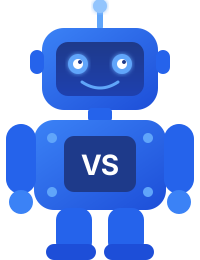

<p align="center">
  
</p>

<h1 align="center">Visual Studio — Assistente de IA Pessoal</h1>

<p align="center">
  
</p>

<p align="center">
  <strong>Seu assistente de IA rodando no seu próprio servidor</strong>
</p>

<p align="center">
  
  
  
  <a href="https://www.visualstudio.com.br"></a>
</p>

---

**Visual Studio** é um gateway de IA pessoal que você instala nos seus próprios servidores. Ele conecta assistentes de inteligência artificial aos canais de mensagem que você já usa, com interface web completa em português brasileiro, a estrutura também é do brasil foi usado o melhor do openclaw e hermes agente, misturando um pouco de robustez de outros projetos, simplificando e melhorando todo desempenho, e atualizado para rodar com LLms inferiores como modelos 4b,8b locais e acima ( via ollama ), sem perder inteligencia.

**Projeto** Todo o projeto está em português do brasil, assim como os comits, setup, terminal, dashboard etc.

## ✨ Funcionalidades

- **Multi-canal** — WhatsApp, Telegram, Slack, Discord, Signal, iMessage, Microsoft Teams, Matrix e muito mais
- **Modelos locais** — suporte nativo a Ollama, LM Studio e outros provedores locais
- **Interface em PT-BR** — painel web completo em português com tema azul
- **Auto-hospedado** — seus dados ficam no seu servidor, não em nuvens de terceiros
- **Extensível** — mais de 140 extensões/plugins disponíveis
- **Voz** — fala e escuta no macOS, iOS e Android
- **Canvas** — renderização de conteúdo interativo em tempo real

## 🚀 Instalação rápida

### Pré-requisitos

- Node.js 22.19+ (recomendado: Node 24)
- pnpm

### Via npm

```bash
npm install -g visual-studio
visual-studio onboard
```

### Via Docker

```bash
docker compose up -d
```

O gateway sobe na porta `18789` por padrão. Acesse a interface web em `http://localhost:18789`.

### Desenvolvimento local

```bash
pnpm install
pnpm dev
```

## 📁 Estrutura do projeto

```
visual-studio/
├── src/              # Backend principal (TypeScript/Node.js)
│   ├── agents/       # Motor de agentes de IA
│   ├── cli/          # Interface de linha de comando
│   ├── daemon/       # Gerenciamento de serviços
│   └── gateway/      # Servidor HTTP/WebSocket
├── ui/               # Interface web (Lit + Vite)
│   └── src/
│       ├── i18n/     # Internacionalização (PT-BR padrão)
│       └── ui/       # Componentes da interface
├── extensions/       # Plugins de canais e provedores
└── packages/         # Pacotes internos compartilhados
```

## 🔧 Configuração

Execute o assistente de configuração para criar sua configuração inicial:

```bash
visual-studio onboard
```

O assistente vai guiá-lo passo a passo pela configuração do gateway, canais e modelos de IA.

## 🐳 Deploy com Docker

```bash
# Suba o container
docker compose up -d
```

Configure as variáveis de ambiente no arquivo `.env` antes de subir. O arquivo `docker-compose.yml` documenta todas as opções disponíveis.

## 🤖 Provedores de IA suportados

- **Nuvem**: OpenAI, Anthropic Claude, Google Gemini, AWS Bedrock, Azure OpenAI
- **Local**: Ollama, LM Studio, llama.cpp
- **Outros**: Groq, DeepSeek, Mistral, Qwen, e mais

## 📱 Canais de mensagem

WhatsApp · Telegram · Slack · Discord · Signal · iMessage · Microsoft Teams · Google Chat · Matrix · Feishu · LINE · Mattermost · Nextcloud Talk · Synology Chat · IRC · Twitch · e mais

---

<p align="center">
  <a href="https://www.visualstudio.com.br">www.visualstudio.com.br</a>
</p>
